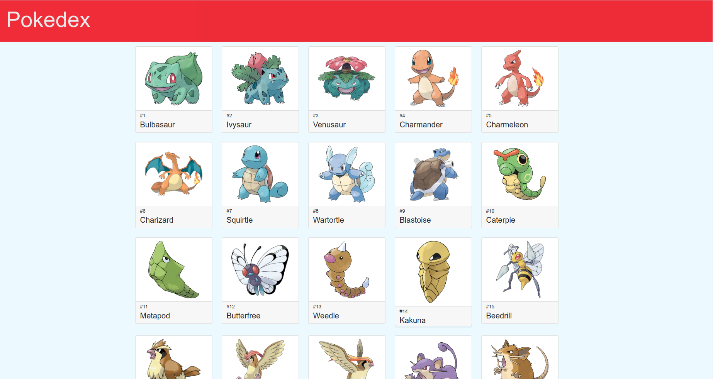
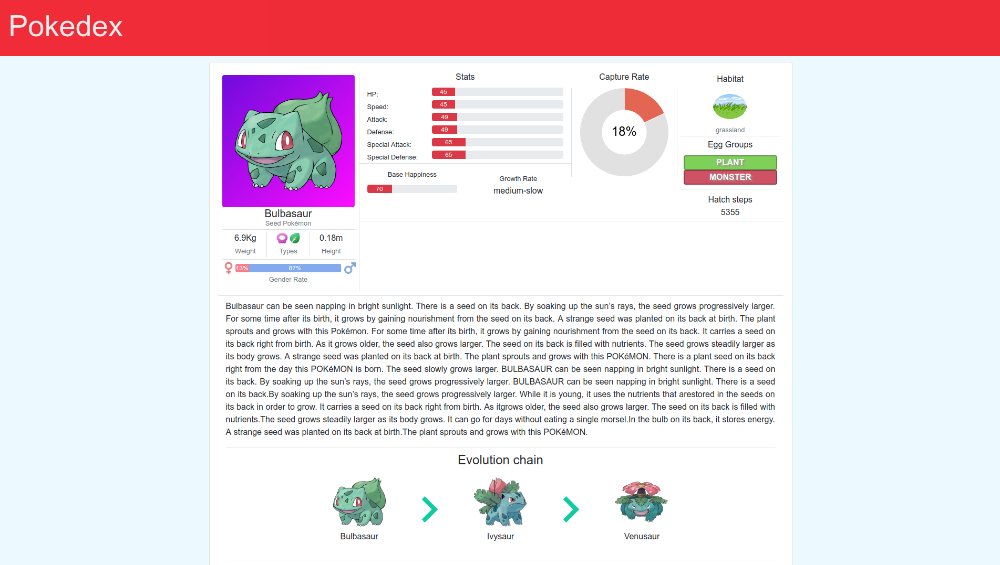

# Pokedex

A pokedex powered by [pokeapi](https://github.com/PokeAPI/pokeapi) and [VueJS](https://github.com/vuejs/vue) 

## Features:
The current version provides info about the 150 pokémons from 1st generation with the following features:

 * Name
 * Type
 * Description
 * Height
 * Weight
 * Gender Rate
 * Stats (HP, Speed, Attack, Defense, Special Attack, Special Defense)
 * Capture Rate
 * Habitat
 * Egg Groups
 * hatch Steps
 * Base Happiness
 * Growth Rate


<br>
<br>


## Build Setup

This apps requires NodeJS and npm to run. After you have both installed, just run the follow commands to build
and run the application.

``` bash
# install dependencies
npm install

# serve with hot reload at localhost:8080
npm run dev

# build for production with minification
npm run build
```
